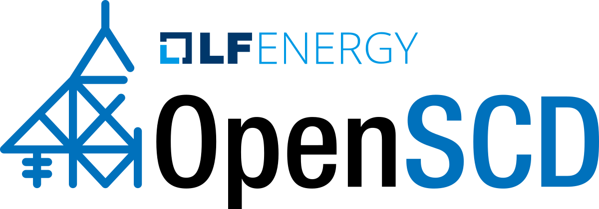

 

  <picture>
    <source media="(prefers-color-scheme: dark)" srcset="https://raw.githubusercontent.com/openscd/.github/main/profile/assets/openscd-logo-white.svg">
    <source media="(prefers-color-scheme: light)" srcset="https://raw.githubusercontent.com/openscd/.github/main/profile/assets/openscd-logo-color.svg">
    
  </picture>

# ⚡️ OpenSCD - IEC 61850 SCL editing tool

**For:** utility/integrator/vendor companies
**Who want:** to enable fully digital substations - from design and commissioning through to maintenance and replacement

**OpenSCD** is an ecosystem that allows flexibility, agility and efficiency in SCL configuration
**That offers:** a web front-end, open-source, extensible, customizable, user-friendly SCL editing

Our product gives you flexibility and control over your own roadmap, and this ultimately prevents vendor-lock-in.  
The open-source community approach to developing software will help accelerate the energy transition.  
OpenSCD aims to provide modules to do system configuration as well as system specification.  

## 👩‍💻 Useful resources

👉 Public hosted version: https://openscd.github.io/  
👉 End-user manual: https://github.com/openscd/open-scd/wiki  
👉 Downstream project with back-end services: https://github.com/com-pas  
👉 Zulip chat: Join us on [Zulip](https://openscd.zulipchat.com)

## Community

The OpenSCD community uses the Contributor Covenant for community guidelines.  
[Code of Conduct](https://github.com/openscd/.github/blob/main/profile/code_of_conduct.md)
